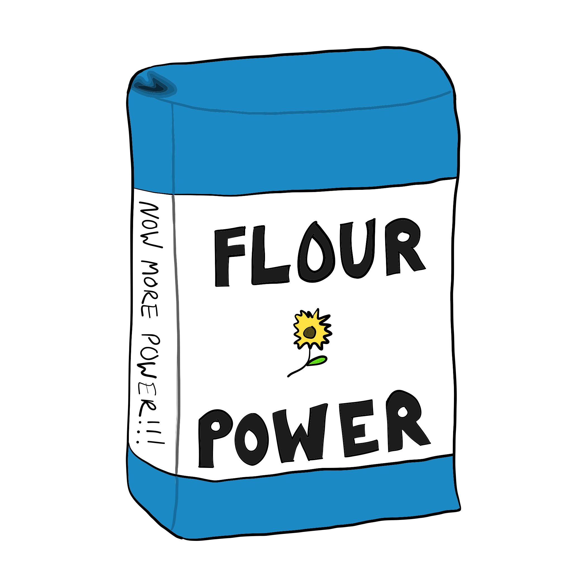
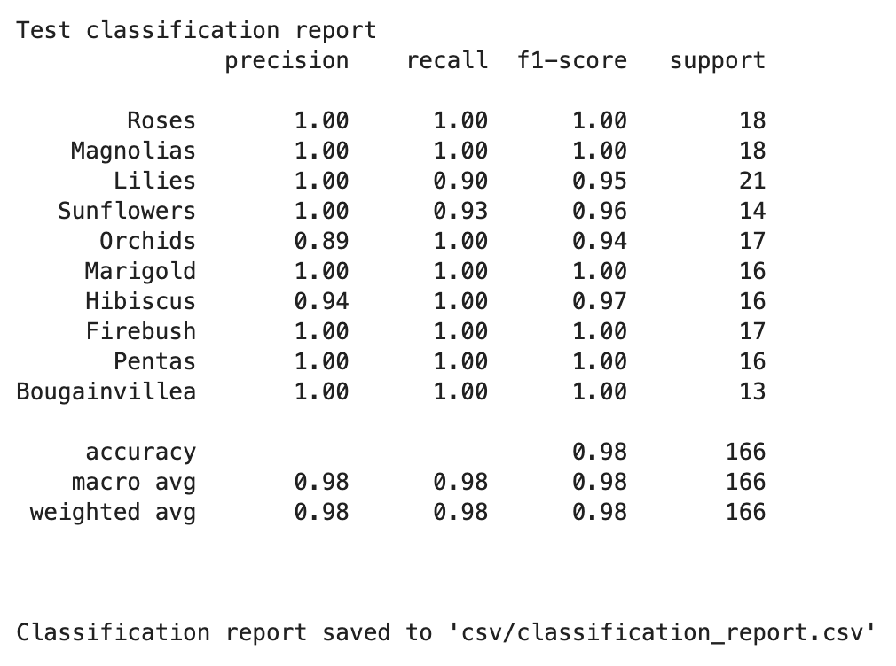

<!-- PROJECT LOGO -->
<br />
<p align="center">
  

  <h3 align="center">EEE3773 - Final Project - Flower Species Classification</h3>

  <p align="center">
    A project utilizing transfer learning for flower species classification.    
    <br />
    <br />
    <a href="#performance-and-results">View Model Performance</a>
    <br />
  </p>
</p>

<br />

<!-- TABLE OF CONTENTS -->
<details open="open">
  <summary>Table of Contents</summary>
  <ol>
    <li><a href="#about-the-project">About The Project</a></li>
    <li><a href="#dependencies">Dependencies</a></li>
    <li><a href="#setup-and-usage">Setup and Usage</a></li>
    <li><a href="#performance-and-results">Performance and Results</a></li>
    <li><a href="#authors">Authors</a></li>
    <li><a href="#acknowledgements">Acknowledgements</a></li>
    <li><a href="#thank-you">Thank You</a></li>
  </ol>
</details>


<!-- ABOUT THE PROJECT -->
## About The Project

This image classification project attempts to classify images of ten species of flowers that were collected by various groups and individuals in Gainesville, Florida. Pictures 
were taken for the following species:
<br />
* Garden Roses
* Southern Magnolias
* Lilies
* Sunflowers
* Orchids
* Marigold
* Hibiscus
* Fire Bush
* Pentas
* Bougainvillea
<br />

<p align="center">
    Over 125 training images of each species to be classified were amassed, as depicted in the bar graph below.
    <br />
    <br />
    
</p>


<!-- (more information and explanation may be added here) -->


<!-- Dependencies -->

## Dependencies

All necessary packages to create and test the accuracy of the image classification mentioned next only require the base packages bundled in the 
[Anaconda](https://www.anaconda.com/) python distribution

<!-- Setup and Usage -->

## Setup and Usage

First, clone the repo!
```sh
git clone https://github.com/EEE3773-UF-Summer2022/final-project-flour-power.git
cd final-project-flour-power
```
<br />

Next, ensure execution of the python scripts is allowed
```sh
chmod u+x create_model.py
chmod u+x evaluate_model_performance.py
```
<br />

Next, copy the training imageset to the root of the project directory. The training imageset can be downloaded from 
[canvas](https://ufl.instructure.com/courses/455012/files/69385213/download) or found in the shared folder when working with HiperGator.

<br />

To train and create the image classification model, one may run
```sh
python create_model.py <name of training imageset> <name of training imageset labels>
```
<br />

> **Note** **To create a test dataset and its labels from the training set, the --debug flag may be used** <br />
> * Use of the debug flag is not required and is helpful when only a training dataset is provided <br />
> * Use of the --debug flag is seen below
<br />

For example, to create a model with the training images and corrected training labels as well as save a derived test set, one may 
run
```sh
python create_model.py data_train.npy corrected_labels.npy --debug
```
<br />

The script will output an image classification model in the h5 format, "image_model.h5" when it has ran successfully.
<br />
<br />

> **Note** **To use a pre-existing model, simply:**
> * Skip execution of the create_model.sh
> * Copy your model file to the root of the project directory
> * Specify your model file when running "evaluate_model_performance.py" as seen below
<br />

To evaluate the model's performance against a user-specified training or testing image set, one may run
```sh
python evaluate_model_performance.py <filename of dataset> <filename of dataset labels <filename of model.h>
```
<br />

> **Warning** **The evaluate_model_performance.py script EXPECTS that the dataset specified is in following format** <br />
> * 270,000 x M (numpy array, where M is the number of test samples)
<br />

For example, to evaulate the performance of the model with the debug test set generated above, one may run
```sh
python evaluate_model_performance.py debug/X_test_from_training.npy debug/X_test_from_training_labels.npy image_model.h5
```
<br />
<br />

*A jupyter notebook,* 'Final Project - Training and Testing Examples.ipynb' *has also been included in this repo. This 
notebook 
includes example code to run the test and train scripts detailed above.*

<br />

<!-- Performance and Results -->
## Performance and Results

The following accuracy was seen when using the test set and its labels generated from the --debug option with the training set

<br />

<p align="center">   
  
</p>

<!-- Authors -->
## Authors

* David Moore - David.moore1@ufl.edu
* Gunnar Fandrich - gunnarfandrich@ufl.edu
* Marc Martorell - mmartorell@ufl.edu
* Garrett Bowman - garrettbowman@ufl.edu

Project Link: [https://github.com/EEE3773-UF-Summer2022/final-project-flour-power.git](https://github.com/EEE3773-UF-Summer2022/final-project-flour-power.git)


<!-- ACKNOWLEDGEMENTS -->
## Acknowledgements

* [Catia Silva](https://faculty.eng.ufl.edu/catia-silva/)

## Thank you

If you made it this far, thank you for reading along and possibly testing our model's performance!

<br />
<br />
<br />
<br />
This README was proudly written 100% with nano :)
